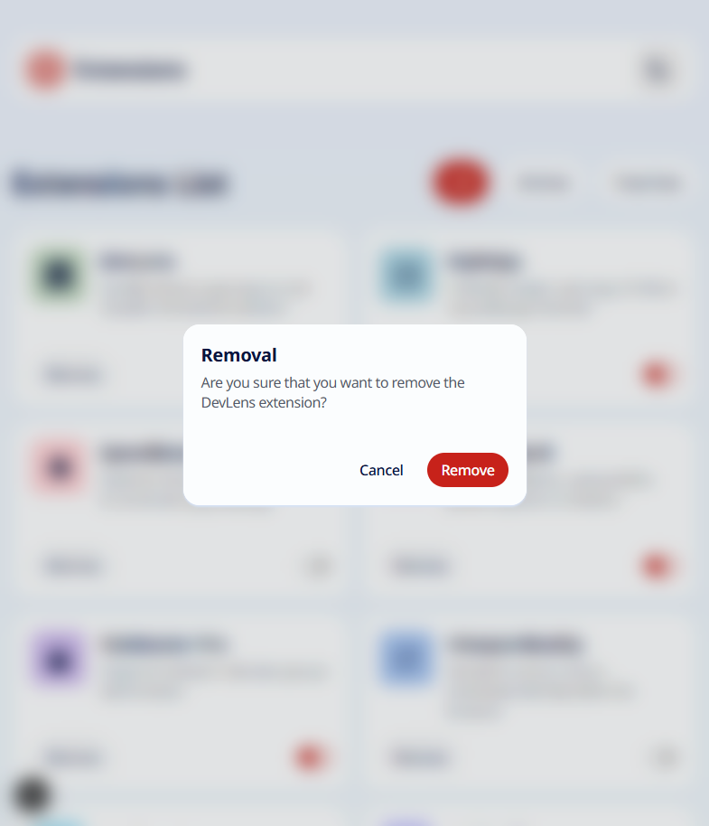

# Frontend Mentor - QR code component solution

This is a solution to the [Browser extensions manager UI challenge on Frontend Mentor](https://www.frontendmentor.io/challenges/browser-extension-manager-ui-yNZnOfsMAp). Frontend Mentor challenges help you improve your coding skills by building realistic projects.

With my solution I went a bit further and created a

- Next.js site deployed on github pages that is
- dinamically adjusts to the default theme of the device or can be set to dark or light mode manually,
- dinamically adjusts to the browser's default font size and is
- reponsive but still
- stick to the Frontend Mentor's design when the default font size is 16px.

Before removing an extension, my Browser extensions manager

- asks for confirmation in a modal that is a
- React functional component
- inserted into a Modal component
- shown when the user clicks on the remove button and
- hide on pressing the ESC key or clicking on the backdrop, on the cancel button or on the remove button.

I created my own Modal Component as well that is

- built upon the `dialog` html element
- directly injected into the DOM element with id `modal-root` and
- for accessibility reasons,
- uses the standard `showModal()` and `close()` functions to show and hide the modal.

The manual integration, end-toend, and accessibility tests increase the confidence that the site works as intended.

_In this practice project, to allow for a broader exploration of different technologies within a limited timeframe, unit tests for the React components were not implemented. However, I have experience writing comprehensive unit tests for React components, and you can see examples of this in the following projects:_

- [Intro component with sign-up form](https://github.com/radkr/intro-component-with-signup-form) or
- [QR code component](https://github.com/radkr/qr-code-component-main)

# Table of contents

- [Overview](#overview)
  - [Screenshot](#screenshot)
  - [Links](#links)
- [My process](#my-process)
  - [Built with](#built-with)
  - [Improved with](#improved-with)
  - [Tested with](#tested-with)
  - [Iterations](#iterations)
    - [Iteration 1](#iteration-1)
    - [Iteration 2](#iteration-2)
    - [Iteration 3](#iteration-3)
    - [Iteration 4](#iteration-4)
    - [Iteration 5](#iteration-5)
    - [Iteration 6](#iteration-6)
    - [Iteration 7](#iteration-7)
    - [Iteration 8](#iteration-8)
  - [What I learned](#what-i-learned)
    - [Touchscreen devices and sticky hover](#touchscreen-devices-and-sticky-hover)
  - [Useful resources](#useful-resources)

# Overview

## Screenshot

**Light desktop view:**


**Light tablet view:**


**Light mobile view:**


**Dark tablet view:**


**Light tablet view with confirmation modal:**



**Dark tablet view with confirmation modal:**


## Links

- Solution URL: [TODO - On Frontend Mentor](#)
- Live Site URL: [On Github Pages](https://radkr.github.io/browser-extensions-manager-ui/)

# My process

## Built with

- Semantic HTML5 markup
- CSS custom properties, Grid, Flexbox
- Mobile-first workflow
- Responsive design (media query)
- Dark theme (next-theme)
- Next.js (server and client components)
- React.js (Context API, create portal)

## Tested with

- WAVE Web Accessibility Evaluation Tool
- Jest + React Testing Library + User Event Testing Library

## Iterations

### Iteration 1

See the styled page on my mobile device.

### Iteration 2

See the styled page on my desktop device.

### Iteration 3

See the styled page on my tablet device.

### Iteration 4

Switch between dark mode and light mode.

### Iteration 5

Filter for active or inactive extensions and set an extension to active or inactive.

### Iteration 6

Remove an extension from the browser.

### Iteration 7

Ask for confirmation before an extension removal.

### Iteration 8

Change the default font size setting.

## What I learned

### Touchscreen devices and sticky hover

_"[...] when the user interacts with this element on a touchscreen: after the tap has been done, the hover effect is stuck on the element. This also occurs when the element is not even activated by the tapping, for instance if it was touched during scrolling."_ [Finally, a CSS only solution to :hover on touchscreens](https://itnext.io/finally-a-css-only-solution-to-hover-on-touchscreens-c498af39c31c)

_"The `hover` media query allows us to detect the user’s primary input mechanism can hover over elements. It can have two values:_

- _`none` detects when the primary input mechanism can’t hover or can’t conveniently hover, like most cellphones and tablets._
- _`hover` detects when the primary input mechanism can hover over elements (for example, desktop computers, laptops, and smartphones with a stylus)."_

[A Guide To Hover And Pointer Media Queries](https://www.smashingmagazine.com/2022/03/guide-hover-pointer-media-queries/)

_"The `pointer` media query helps us to detect how accurate the primary pointer device is. This media query has three values:_

- _`none` detects when the main input mechanism doesn’t have a pointer device (for example cellphones);_
- _`coarse` detects when the main input mechanism has a pointer device with limited accuracy (like the remote control of a Smart TV or some video game consoles);_
- _`fine` detects when the primary input mechanism has an accurate pointer device (like a mouse, touchpads, or stylus)."_

[A Guide To Hover And Pointer Media Queries](https://www.smashingmagazine.com/2022/03/guide-hover-pointer-media-queries/)

_"[Implementing an interactive element with relative small size] fine for desktop computers or laptops, even for a stylus device, but if you need to use your fingers, you’ll find choosing an option can be bothersome — you could select an option you don’t want because of that."_ [A Guide To Hover And Pointer Media Queries](https://www.smashingmagazine.com/2022/03/guide-hover-pointer-media-queries/)

Desktop Environments with Touchscreens: Modern operating systems and hardware allow for desktop and laptop computers with touchscreens. These devices do have the capability to "hover" with a mouse or trackpad, even though they also support touch input. Therefore, `@media (hover: hover)` would evaluate to true on these devices, even though the user might primarily interact with them via touch. This could lead to a desktop-optimized interface being served when a touch-optimized one would be more appropriate.

`@media (hover: hover) and (pointer: fine)`: This combination reliably identifies those devices that has touchscreen but used by pointing device or stylus at the moment.

Example media query I finally used in my design for hover states:

```css
/* Enable hover only on non-touch devices */
@media (hover: hover) and (pointer: fine) {
  .button:hover {
    background-color: var(--neutral-600);
    cursor: pointer;
  }
}
```

### Server and Client side components

_"We established earlier that any component imported from a Client Component would itself become a Client Component. So… how do you make a Server Component a child of a Client Component? Long story short, pass Server Components as children or props instead of importing them. The Server Component will be rendered on the server, serialized, and sent to your Client Component."_ [Everything I wish I knew before moving 50,000 lines of code to React Server Components](https://www.mux.com/blog/what-are-react-server-components#1-add-use-client-directive-to-the-root-of-your-app)

_"If you want to be extra sure that your Server Component will never get included in a bundle, you can import the server-only package. This is extra handy if you want to make sure a large library or a secret key doesn’t end up where it shouldn’t. (Though if you’re using Next.js, it will protect you from accidentally shipping your environment variables.)"_ [Everything I wish I knew before moving 50,000 lines of code to React Server Components](https://www.mux.com/blog/what-are-react-server-components#1-add-use-client-directive-to-the-root-of-your-app)

_"If you want to know during runtime if the component is being rendered on the server or client. you can check if window is defined or not:"_ [How do I know if I'm on the client or server component in the code. Nextjs 13 Beta appDir](https://stackoverflow.com/questions/75081888/how-do-i-know-if-im-on-the-client-or-server-component-in-the-code-nextjs-13-be)

```javascript
const componentType = typeof window === "undefined" ? "server" : "client";
```

_"You can use process.browser to distinguish between server environment (NodeJS) and client environment (browser). `process.browser` is `true` on the client and `undefined` on the server."_ [How do I detect whether I am on server on client in next.js?](https://stackoverflow.com/questions/49411796/how-do-i-detect-whether-i-am-on-server-on-client-in-next-js)

## Useful resources

**Sticky hover:**

- [Finally, a CSS only solution to :hover on touchscreens](https://itnext.io/finally-a-css-only-solution-to-hover-on-touchscreens-c498af39c31c)
- [Solving Sticky Hover States with @media (hover: hover)](https://css-tricks.com/solving-sticky-hover-states-with-media-hover-hover/)
- [A Guide To Hover And Pointer Media Queries](https://www.smashingmagazine.com/2022/03/guide-hover-pointer-media-queries/)

**Server and Client side components:**

- [Everything I wish I knew before moving 50,000 lines of code to React Server Components](https://www.mux.com/blog/what-are-react-server-components#1-add-use-client-directive-to-the-root-of-your-app)
- [Server and Client Composition Patterns](https://nextjs.org/docs/app/building-your-application/rendering/composition-patterns#keeping-server-only-code-out-of-the-client-environment)
